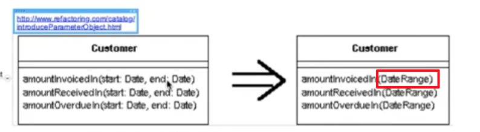
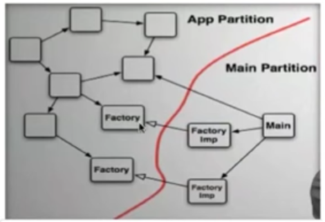

## 5. Function Structure

#### 1. Arguments

- 인자가 많아지면 복잡도가 증가 (Max 인자 3개를 권장)

- Introduce Parameter Object: 인자가 여러개일 경우 해당 인자가 무엇인지 인식할 수 있는 클래스를 생성할 것
  - Start:Date, end:Date 를 DateRange 클래스로 대체

- 생성자의 많은 수의 인자를 넘겨야 한다면 
  - 차라리 좋은 이름을 갖는 setter가 낫다. (setter의 단점은 setter가 완료되기 전까지 그 객체는 불완정한 상태에 빠질 수 있음 - inconsistent state)
  - 빌더 패턴을 적용하는 것이 더 좋은 방법임.

- Boolean을 인자로 사용하여 값(true/false)에 따라 여러일을 하는 경우는 지양 할 것. 차라리 2개의 함수를 분리하고 공통되는 코드는 다시 함수를 만들어 이 함수를  사용할 것

- input은 input으로 끝내고 절대 output으로 사용하지 말 것.
- the null defense
  - null을 전달/기대하는 함수는 없어야 함. null을 전달하는 함수는 boolean을 전달하는 것 만큼 잘못 된 것임(null & not null case)
  - 단, public api의 경우는 defensive 하게 programminig 하므로 null 체크를 함.
  - null을 boolean 처럼 쓰지 말것
  - Defensive programing을 지양할 것. null을 리턴하게 되면, 그 뒤 메소드들이 전부 null 체크를 하게 된다. null 여부를 지속적으로 조사할 것이 아니라 단위 테스트에서 검증해야 함.

#### 2. The Stepdown Rule

- 모든 public은 위로, private은 아래로. private 메소드 명을 잘 짓는다면 굳이 아래(body, private 메소드가 구현된 곳)을 보지 않아도 이해가 될 것임. public 파트만 사용자들에게 전달하면 됨.
- 중요한 부분은 위로, 상세한 부분은 밑으로. 잡지의 예) 헤드라인, 시놉시스, 아웃라인, 상세 내역
- backward reference 없이 top에서 bottom으로 읽을 수 있어야 함.

#### 3. switches and cases

- 객체 지향의 가장 큰 장점은 의존성 관리 능력임. 객체 지향을 이용하면, run time 의존성은 그대로 둔 채 source code 의존성을 역전시킴(Dependency Inversion Principle)
  - 본래의 의존성을 제거 → polymorphic interface 삽입 → 모듈 A는 인터페이스에 의존하고, 모듈 B는 인터페이스로부터 derive한다.
  - Independent Deployability: one of OO의 강점. 인터페이스만 변경되지 않으면 모듈 A를 작업하고 있는 사람과 모듈 B를 작업하고 있는 사람이 동시에 구현 가능.
- switch 문장은 독립적 배포에 방해가 됨
  - switch 문장은 각 case 문장은 외부 모듈에 의존성을 가지며, 또 어떤 경우에는 다수의 다른 모듈에 의존성을 가질 수 있음 (fan-out problem)
  - switch 문장에서 source code 의존성은 flow of control 방향이 같음. Switch 문장이 변경될 경우 모든 외부 모듈에 영향을 끼침, 외부 모듈 중 하나라도 변경이 일어나면 switch 문장이 영향을 받음. 또한 switch에 의존하는 다른 모든 것들도 영향을 받음.
  - 독립적 배포를 불가능하게 하는 많은 의존성을 만들며 독립적 컴파일 / 개발도 불가능해짐.
- switch 문장 제거 절차
  - switch 문장을 polymorphic interface 호출로 변환
  - case에 있는 문장들을 별도의 클래스로 추출하여 변경 영향이 발생하지 않도록 한다.
- [실습](https://github.com/msbaek/videostore)
  - Test부터 Polymorphic하게 수정(switch case별로 클래스 생성)
  - make it pass
  - 중복 제거 `new NewReleaseMovie("New Release 1", Movie.NEW_RELEASE);`
  - IntelliJ의 `push members down` 을 통해 클래스 계층 구조 정리(상위 클래스의 멤버 메소드 혹은 변수를 지정한 하위 클래스로 이동시켜줌) - determineAmount, determineFrequentRentalPoint. 기본 클래스의 추상 메소드로 두고, 메소드를 받아, switch case 별로 하위 클래스에서 구현
  - IntelliJ의 `run with coverage` 로 사용되지 않는 코드는 제거
  - IntelliJ의 `Inlline... Refactor` 로 의미없는 변수 선언 제거
- Application/min partition   : 팩토리(추상 클래스, 인터페이스)에 어떤 구현체를 넣어줄 것인지 결정하는 것이 Main이며, 스프링에서는 이를 dispatcher servlet이 담당함. 
  - Application Partition: 대개의 어플리케이션 코드가 존재하는 곳
  - Main Partition: 하위 레벨(factory - 추상클래스, 인터페이스, configuration data, main program)
  - 항상 모듈 다이어그램에서 App 파티션과 Main 파티션 사이에 선을 그을 수 있어야 함.
  - 한방향의 의존성(from Main to App). 메인에서 어플리케이션 파티션으로의 소스코드 의존성은 있지만 어플리케이션 파티션에서 메인으로의 소스코드 의존성은 없음.
  - Main 파티션은 App 파티션의 플러그인
  - 이러한 기법을 DI (Dependency Injection) 이라고 함.

