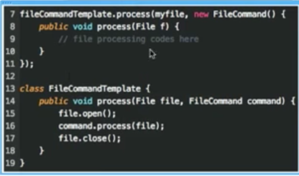
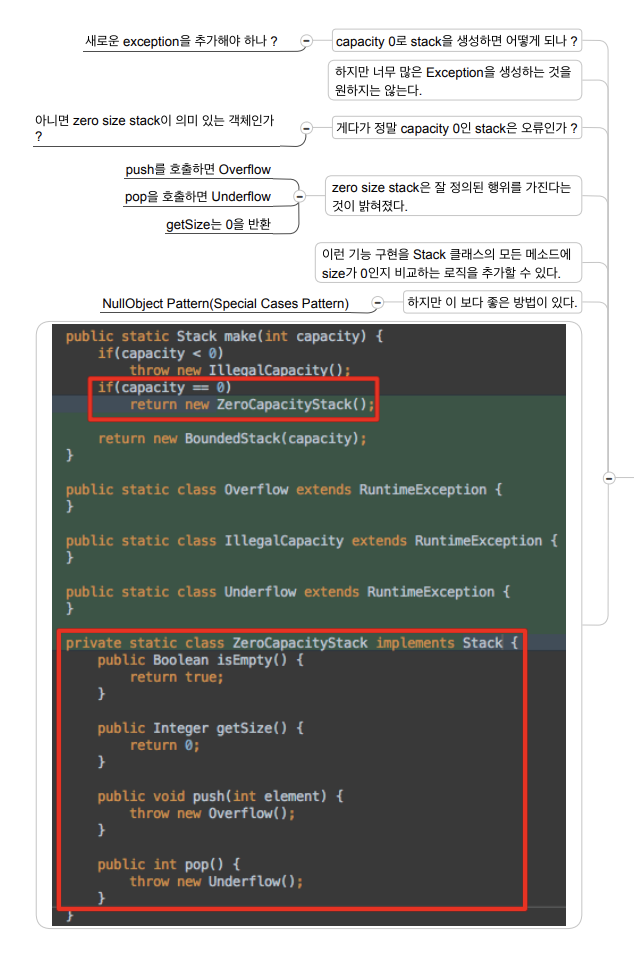

## Function Structure (2)

#### 4. Temporal Coupling

- 함수들이 순서를 지키며 호출되어야 함. 파일오픈 → 파일 수정 → 파일 클로즈와 같이 임시의 커플링이 발생하는 경우 전략패턴을 고려한다.

- passing a Block

  


#### 5. CQS - Command(상태 변경) Query(상태 반환) Seperation(분리)

- CQS는 side effect를 관리하는 좋은 방법. 
  - 예) 쿼리를 던졌는데, 내부 상태 변경이 일어남. 이런 경우 내부 상태 변경 없이는 쿼리를 변경할 방법이 없음. getCount 메소드는 호출될 때마다 count 값을 1씩 증가한다고 가정할 경우,  count값을 올리지 않고서는 getCount 메소드를 호출할 수 있는 방법이 없음.
- Command : 시스템의 상태 변경이 가능하며 side effect를 가짐. 그리고 아무것도 반환하지 않음
- Query: side effect가 없으며, 계산값이나 시스템의 상태를 반환함.

- CQS의 정의: 상태를 변경하는 함수는 반환하면 안되며 값을 반환하는 함수는 상태를 변경하면 안됨

- 예시 

  -  `User u = authorizer.login(userName, password);`  유저를 사용하기 위해서는 항상 로그인을 해야함. 반대로, 로그인을 하면 원치 않아도 유저 정보를 읽어야 함
  - 따라서, `authorizer.login(userName, password);` & `User u = authorizer.getUser(userName)` 으로 구분시킬 수 있음.

- 당신 코드의 독자들을 혼란스럽게 하지 말라. (신뢰의 문제. 약속) 

  - 값을 반환하는 함수는 상태를 변경하면 안된다.
  - 상태를 변경하는 함수는 Exception을 발생 시킬 수는 있지만 값을 반환할 수는 없다.

  

#### 6. Tell Don't Ask

- extreme한 CQS는 C와 Q를 함께 사용하지 말도록 한다.
  - `user.isLoggedIn()` 는 쿼리 메소드이며, `user.execute(command)` , `authenticator.promptLogin();` 는 커맨드 메소드임.

```java
if (user.isLoggedIn()) 
  user.execute(command);
else
  authenticator.promptLogin();
```

- 아래와 같이 예외를 사용하는 것이 나아보이지 않나?  이 경우 쿼리는 없으며 커맨드 메소드만 존재.

```java
try {
  user.execute(command); // execute할 때 내부적으로 isLoggedIn을 호출
}
catch(User.NotLoggedIn e) {
  annuciator.promptLogin(); 
}
```

- 나아가 `user.execute(command, annuciator);` 처럼 유저 객체가 모든 것을 처리하도록 하는 것이 더 나아보인다.
- 만든사람의 how에 집중 할 것이 아니라 보는 사람의 why의 관점에서 볼 때, 마지막 경우 `user.execute(command, annuciator);` 가 제일 보기 좋음.(코드가 적으니까..) 
- 로그인되었는지 아닌지 아는 것은 유저 객체가 알아야 할 일. 로그인 여부 상태는 유저 객체에 속함. 왜 유저 상태를 가져다가 유저 대신 결정을 하는가? 유저가 해당 행위를 수행하는 것이 맞음.
- Tell Don't Ask:  해당 객체가 해야할 일을 다른 객체가 하지 않도록 하자. (해당 객체의 상태를 다른 곳에서 불러와서 판단하고 일을 수행하지 말고 그 객체 내부에서 진행하도록 하자) 
- 이 규칙을 준수하다보면 쿼리메소드가 필요 없어짐.(쿼리 메소드는 제어하기가 상당히 어렵기 때문에, 이는 매우 좋은 것임)
- Long chain of function(Train wrecks)은 Tell, Don't ask를 명확하게 위반하고 있음. 뭔가를 tell(do XXX) 하기 전에 지속적으로 ask(get XXX) 하고 있음.

```java
o.getX()
  .getY()
  	.getZ()
  		.do()); // 위의 코드를

o.DoSomething(); // 아래 처럼 변경 해야함.
```


#### 7. Law of Demeter

- 하나의 함수가 전체 시스템의 객체들 간의 네비게이션을 아는 것은 잘못된 설계

  ```java
  o.getX()
    .getY()
    	.getZ()
    		.do()); 
  
  // o는 x를 갖는다. x는 y를 갖는다. y는 z를 갖는다. z는 do를 할 수 있다.
  // 한 라인의 코드가 알ㄹ아야 하는 것으로 너무 방대한 지식이고 함수가 시스템에 너무 많은 의존성을 가짐.
  ```

- 함수가 시스템의 전체를 알게 하면 안된다.

- 개별 함수는 아주 제한된 지식만 가져야 한다.

- 객체는 요청된 기능 수행을 위해 이웃 객체에게 요청해야 한다.

- 요청을 수신하면 적절한 객체가 수신할 때까지 전파되어야 한다.

- Law of demeter는 아래와 같은 일련의 규칙들을 통해 Tell, Don't ask를 형식화(formalize)한다.

  - 아래와 같은 객체들의 메소드만 호출할 수 있다.
    - 인자로 전달된 객체 // locally 생성한 객체 // 필드로 선언된 객체 // 전역 객체
  - 이전 메소드 호출의 결과로 얻는 객체의 메소드를 호출하면 안된다.
    - `o.getX().getY().getZ().doSomething()` 

- Ask 대신 tell 하면 surrounding과 decouple 된다. 

  - ask를 하면 내가 이웃하는 객체가 가지고 있는 이웃하는 객체... 줄줄이 끌고 들어감. 의존성(coupling)이 매우 복잡해 짐. 그러나 만약 tell한다면  나와 이웃하는 객체와만 의존성을 가지며 나머지랑은 decouple됨.


#### 8. early return

```java
private boolean nameIsValxxx
  if (name.equal(""))
    return true;
	if (WikiWordWidget.xxx)
    return true;
	return false;
```

- early return 이나 guarded return은 허용됨. 조건문 사용시 else / return이 먼저 나오게 할 것.
- 루프의 중간에서 리턴하는 것은 문제
  - Break, 루프 중간에서의 return은 loop를 복잡하게 함.
  - 코드가 동작하도록 하는 것보다 이해 할 수 있게 하는 것이 더 중요.


#### 9. error handling

- stack을 TDD로 구현한 것. https://github.com/msbaek/stack-example
  - 아무것도 없는 상태에서 pop을 호출하는 경우는 어떻게 해야할까? push 메소드가 성공하면 true를 반환하고 실패하면 false를 반환하는 건 어떨까?
  - 이러한 예외 상황이 생겼을 때는 exception을 발생시키는 것이 좋음. exception의 이름은 최대한 구체적이여야한다. 예) Stack.Overflow

```java
public static Stack make(int capacity) {
  if(capacity < 0)
    throw new IllegalCapacity();
  if(capacity == 0)
    return new ZeroCapacityStack();

  return new BoundedStack(capacity);
}

public static class IllegalCapacity extends RuntimeException {
}
```

- UncheckedException은 스프링같은 컨테이너에서 롤백 대상이 되므로, 커스텀 Exception은 무조건 RuntimeException을 상속받자.
  - checkedException 구현하게 될 경우 해당 메소드를 사용하는 모든 메소드에서 catch를 해야한다.
  - checkedException은 사용하지 않는 편이 좋다.
- exception은 이름을 잘 지어서 메세지가 없어도 이름만으로 이해하기 쉬운것이 좋은 형태이다.


#### 10. Special cases



#### 11. Null is not an error

- stack이 empty일 때 top 함수는 무엇을 반환해야 하나? 
  - null을 반환 할 수 도 있지만, top을 호출하는 아무도 null을 기대하지는 않을 것이다.
  - null을 기대하면 항상 null 체크를 함. 
  - NullPointException을 발생시킬 때 까지 시스템의 여기저기에 조용히 퍼지는 속성이 있다.
  - StackEmpty exception 을 발생시키는 것이 좋아 보인다.

- null을 기대하지 않는 상황이라면 차라리 exception이 낫다.


#### 12. Null is a value

- find가 element가 찾지 못하면 어떻게 해야 하나?
  - 찾고자 하는 엘리먼트가 없을 때 exception을 던져야하나? 어떤 때는 사람들이 find가 실패할 것을 기대하기도 함. top의 경우 실패할 것을 기대하지 않음. 그러나 find는 실패할 것을 기대하기도 함.
  - 이런 경우, Exception을 던지는 것보다 NotFound를 나타내는 값을 넘기는 것이 좋음.
- string의 indexOf 메소드에서 NotFound의 값은 -1임. 그런데 -1은 별도의 의미를 가짐(-1은 Nothing이 아님)
- 따라서 null을 반환하는게 좋을 수 있음.


#### 13. try도 하나의 역할/기능이다.

- 함수 내에서 try 문장이 있다면 try 문장이 변수 선언을 제외하고는 첫번째 문장이어야 한다
- try 블럭 내에는 한 문장(함수 호출)만 있어야 한다. 
- finally가 함수의 마지막 블럭이어야 한다. 이후에 어떤 라인도 없어야 한다.
- 함수는 하나의 일만 해야 한다.
- error handling은 하나의 일이다.

